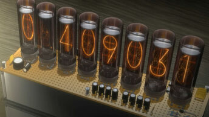

# divergence-meter-profile

## Introduction

Show Divergence Meter on your Github Profile.

Divergence Meter is an array of Nixie tubes that uses an unknown method to determine the "Divergence Value" of the current world line in relation to the absolute world line of 0%.



## How to Use

Just add the following API as an image into your Github Profile:

`https://divergence-meter-profile.vercel.app/api/divergence-meter`

The divergence meter is rendered in the vercel app and returned as a SVG file, so you can use the url as a normal image, like

```

```

## Example

You can also check my Github Profile for preview


## The Algorithm of Calculating Divergence

The algorithm is inspired by an old Chrome extension called "loliVector", and I cannot find any open source code/author information about it. I'd appreciate to be told if you have any clue about the related infos of this extension.

You can check [here](https://github.com/windmgc/divergence-meter-profile/blob/main/src/services/divergence-meter.ts#L29) for more details.

## Acknowledgments

The following project had particular influence on this repo:

- Chrome Extension "loliVector"

- [andyruwruw/andyruwruw](https://github.com/andyruwruw/andyruwruw), which providing the way to render dynamic web contents into SVG in vercel apps. Most of the general functions are copied from this repo.
